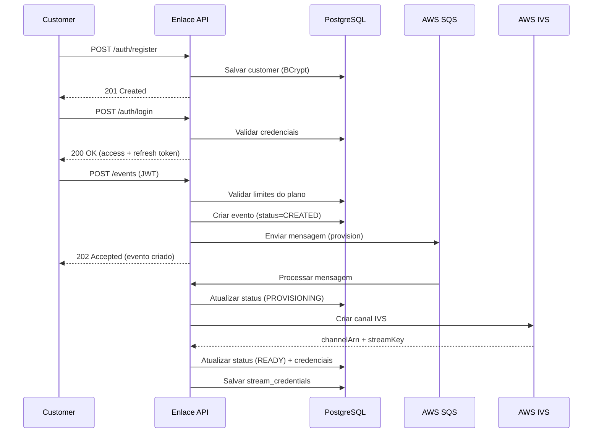
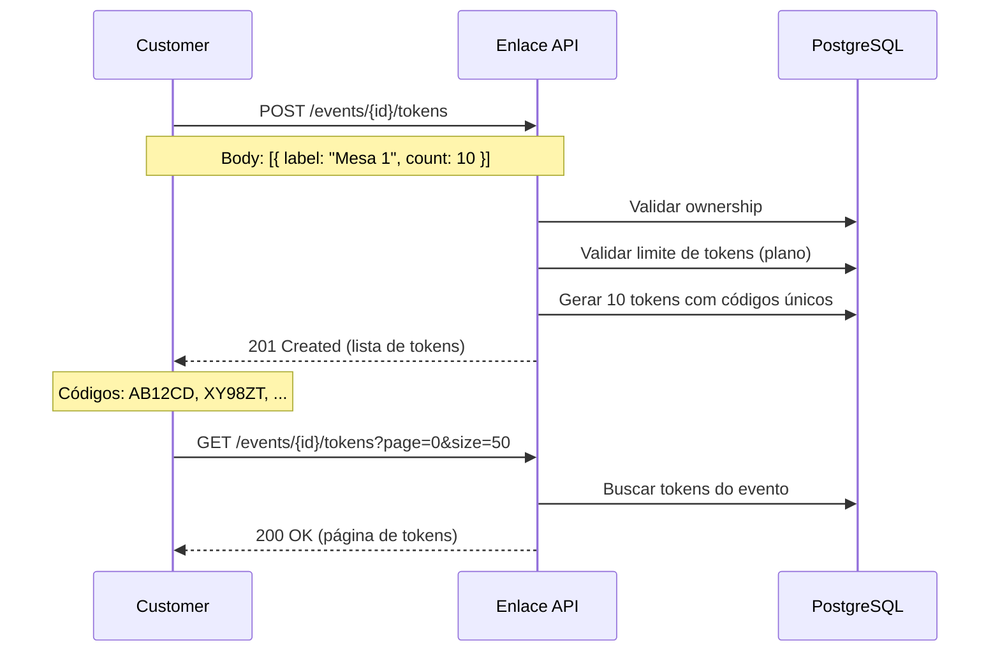
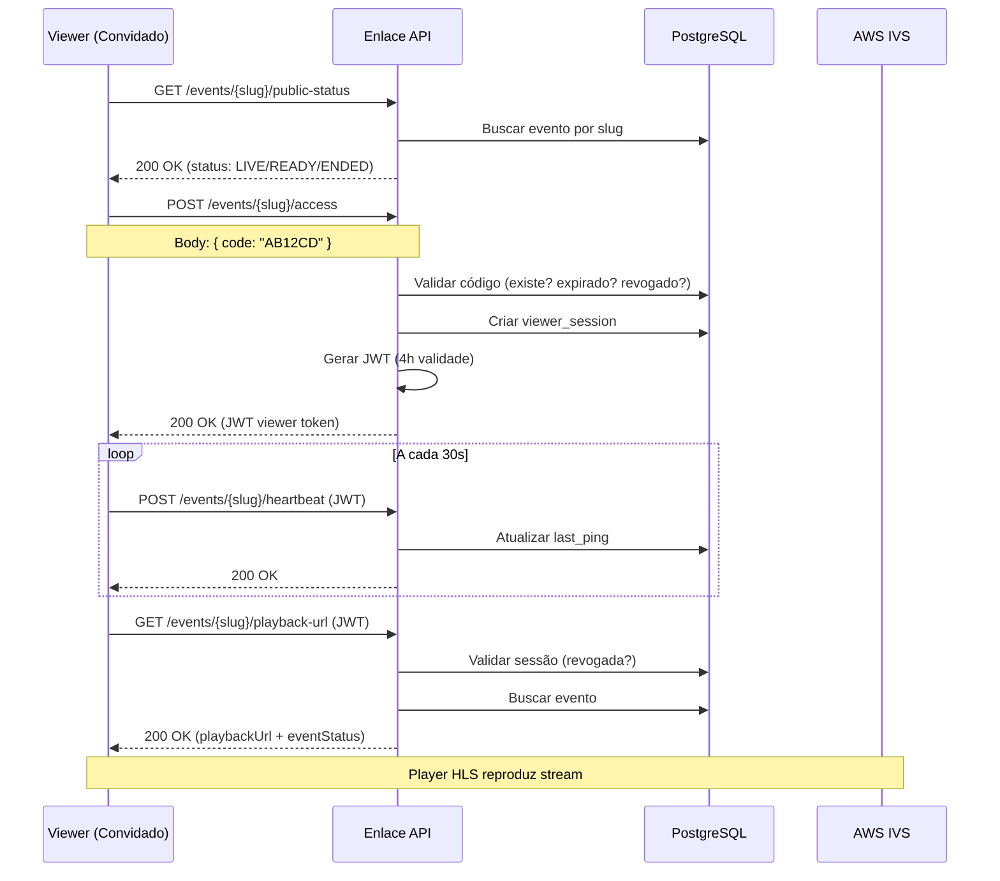
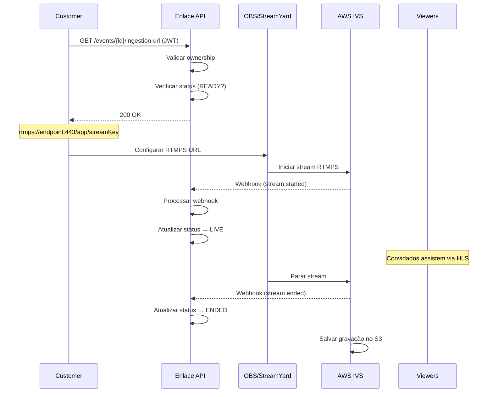
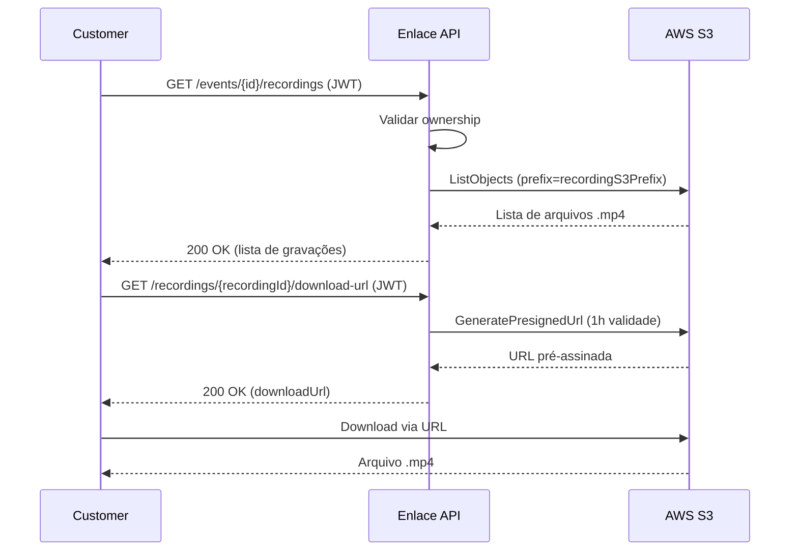

# 🎥 Enlace Lives - API Backend

> Plataforma completa para gestão e transmissão de lives de eventos de casamento

[](https://spring.io/projects/spring-boot)
[](https://openjdk.java.net/)
[](https://www.postgresql.org/)
[](https://aws.amazon.com/ivs/)

---

## 📋 Índice

- [Sobre o Projeto](#-sobre-o-projeto)
- [Regras de Negócio](#-regras-de-negócio)
- [Fluxos Principais](#-fluxos-principais)
- [Arquitetura](#-arquitetura)
- [Stack Tecnológico](#-stack-tecnológico)
- [Modelo de Dados](#-modelo-de-dados)
- [API Endpoints](#-api-endpoints)
- [Fluxos Técnicos](#-fluxos-técnicos)
- [Setup & Instalação](#-setup--instalação)
- [Variáveis de Ambiente](#-variáveis-de-ambiente)
- [Testes](#-testes)
- [Deployment](#-deployment)
- [Monitoramento](#-monitoramento)

---

## 🎯 Sobre o Projeto

**Enlace Lives** é uma API REST para gestão completa de eventos de transmissão ao vivo de casamentos. A plataforma permite que organizadores (customers) criem eventos, configurem transmissões via Amazon IVS, gerem códigos de convite únicos para convidados e controlem o acesso às lives em tempo real.

### Principais Funcionalidades

- 🔐 **Autenticação e Autorização** - Sistema completo de registro, login e refresh tokens
- 📺 **Gestão de Eventos** - CRUD completo com provisionamento automático de canais de streaming
- 🎫 **Sistema de Convites** - Geração de códigos únicos de 6 dígitos para acesso controlado
- 📹 **Streaming ao Vivo** - Integração completa com Amazon IVS (Interactive Video Service)
- 👥 **Monitoramento de Viewers** - Rastreamento em tempo real de convidados assistindo
- 💾 **Gravações** - Gestão e download de gravações armazenadas no S3
- 📊 **Planos e Limites** - Sistema de planos BASIC e PRO com limites configuráveis
- 🔍 **Auditoria** - Log completo de ações para compliance e segurança

---

## 📐 Regras de Negócio

### 1. Planos e Limites

| Recurso | Plano BASIC | Plano PRO |
|---------|-------------|-----------|
| **Eventos Ativos Simultâneos** | 1 | 10 |
| **Tokens/Convites por Evento** | 50 | 500 |
| **Gravações** | ✅ Sim | ✅ Sim |
| **Monitoramento em Tempo Real** | ✅ Sim | ✅ Sim |

**Regras:**
- Um evento é considerado "ativo" se não foi deletado e seu status é diferente de `ENDED`
- Ao tentar exceder o limite, a API retorna erro `422 - PLAN_LIMIT_EXCEEDED`
- Tokens revogados não contam no limite
- Upgrade de plano libera recursos imediatamente

### 2. Ciclo de Vida de um Evento

```
CREATED → PROVISIONING → READY → LIVE → ENDED
            ↓
    PROVISIONING_FAILED
```

**Estados:**
- **CREATED**: Evento criado, aguardando provisionamento do canal IVS
- **PROVISIONING**: Criando canal Amazon IVS (assíncrono via SQS)
- **READY**: Canal IVS criado, credenciais RTMP disponíveis
- **LIVE**: Transmissão em andamento (detectado via webhook IVS)
- **ENDED**: Transmissão finalizada
- **PROVISIONING_FAILED**: Falha ao criar canal (pode retentar)

**Transições Permitidas:**
- CREATED → PROVISIONING, PROVISIONING_FAILED
- PROVISIONING → READY, PROVISIONING_FAILED
- PROVISIONING_FAILED → PROVISIONING (retry)
- READY → LIVE, ENDED
- LIVE → ENDED
- ENDED → (estado final, sem transições)

### 3. Tokens de Convite

**Características:**
- Código alfanumérico de 6 dígitos (ex: `AB12CD`)
- Válido por 72 horas (configurável)
- Pode ser usado apenas uma vez para criar sessão JWT
- Pode ser revogado pelo organizador a qualquer momento
- Status de entrega: `PENDING`, `SENT`, `DELIVERED`, `FAILED`

**Regras:**
- Código inválido → `401 - INVALID_INVITE_CODE`
- Código já usado → `401 - INVITE_CODE_ALREADY_USED`
- Código revogado → `401 - SESSION_REVOKED`
- Token expirado → `401 - TOKEN_EXPIRED`

### 4. Sessões de Viewer

**Autenticação:**
- Viewer valida código de convite → recebe JWT com 4 horas de validade
- JWT contém: `jti` (session ID), `event_id`, `event_slug`, `viewer_token_id`
- JWT usado para acessar URL de playback da live
- Sessões podem ser revogadas individualmente pelo organizador

**Heartbeat:**
- Viewer envia ping a cada 30 segundos para `/events/{slug}/heartbeat`
- Organizador consulta viewers ativos (ping nos últimos 60s) via `/events/{id}/viewers/count`

### 5. Ownership e Segurança

**Princípio:** Customers só podem acessar e modificar seus próprios recursos

**Validações:**
- Todos endpoints de eventos verificam `event.customerId == authenticatedCustomerId`
- Tentativa de acesso a recurso alheio → `403 - FORBIDDEN`
- JWT inválido ou expirado → `401 - UNAUTHORIZED`
- Senhas armazenadas com BCrypt (custo 10)
- JWTs assinados com RS256 (chaves assimétricas RSA 2048 bits)

### 6. Rate Limiting

- Máximo de 10 tentativas de validação de código por minuto (por IP)
- Excesso → `429 - RATE_LIMIT_EXCEEDED`
- Configurável via `app.rate-limit.max-attempts-per-minute`

---

## 🔄 Fluxos Principais

### Fluxo 1: Cadastro e Criação de Evento



### Fluxo 2: Geração de Convites



### Fluxo 3: Acesso do Convidado



### Fluxo 4: Transmissão ao Vivo



### Fluxo 5: Download de Gravações



---

## 🏗️ Arquitetura

### Arquitetura Hexagonal (Ports & Adapters)

```
src/main/java/com/enlace/
│
├── domain/                          # Camada de Domínio (regras de negócio)
│   ├── model/                       # Entidades de domínio
│   │   ├── Customer.java
│   │   ├── Event.java
│   │   ├── ViewerToken.java
│   │   ├── ViewerSession.java
│   │   ├── EventStatus.java (enum)
│   │   └── Plan.java (enum)
│   │
│   ├── port/
│   │   ├── in/                      # Portas de entrada (use cases)
│   │   │   ├── AuthenticateCustomerUseCase.java
│   │   │   ├── CreateEventUseCase.java
│   │   │   ├── ValidateInviteCodeUseCase.java
│   │   │   └── ...
│   │   │
│   │   └── out/                     # Portas de saída (interfaces)
│   │       ├── CustomerRepository.java
│   │       ├── EventRepository.java
│   │       ├── IvsGateway.java
│   │       └── S3Gateway.java
│   │
│   ├── service/                     # Implementação dos use cases
│   │   ├── AuthenticateCustomerService.java
│   │   ├── CreateEventService.java
│   │   ├── PlanLimitsService.java
│   │   ├── EventOwnershipValidator.java
│   │   └── ...
│   │
│   └── exception/                   # Exceções de domínio
│       ├── EventNotFoundException.java
│       ├── ForbiddenException.java
│       ├── PlanLimitExceededException.java
│       └── ...
│
├── infrastructure/                  # Camada de Infraestrutura (adaptadores)
│   ├── web/                         # Adaptador HTTP (REST API)
│   │   ├── controller/
│   │   │   ├── AuthController.java
│   │   │   ├── EventController.java
│   │   │   ├── ViewerAccessController.java
│   │   │   ├── ViewerTokenController.java
│   │   │   └── RecordingController.java
│   │   │
│   │   ├── dto/                     # DTOs de entrada/saída
│   │   │   ├── CreateEventRequest.java
│   │   │   ├── EventResponse.java
│   │   │   ├── PagedResponse.java
│   │   │   └── ...
│   │   │
│   │   └── advice/
│   │       └── GlobalExceptionHandler.java
│   │
│   ├── persistence/                 # Adaptador de persistência (JPA)
│   │   ├── CustomerEntity.java
│   │   ├── EventEntity.java
│   │   ├── JpaCustomerRepository.java (implementa CustomerRepository)
│   │   └── ...
│   │
│   ├── aws/                         # Adaptadores AWS
│   │   ├── IvsGatewayAdapter.java
│   │   ├── SqsConsumer.java
│   │   └── AwsConfig.java
│   │
│   └── config/                      # Configurações
│       ├── SecurityConfig.java
│       ├── CustomerJwtService.java
│       ├── OpenApiConfig.java
│       └── ...
│
└── shared/                          # Utilitários compartilhados
    ├── SlugGenerator.java
    ├── InviteCodeGenerator.java
    └── TokenGenerator.java
```

### Diagrama de Componentes

```
┌─────────────────────────────────────────────────────────────┐
│                         Frontend                             │
│                    (React/Next.js/etc)                      │
└────────────────────┬───────────────────────────────────────┘
                     │ HTTPS / REST
                     ▼
┌─────────────────────────────────────────────────────────────┐
│                    Spring Boot API                           │
│  ┌─────────────┐  ┌──────────────┐  ┌──────────────────┐  │
│  │ Controllers │→→│  Use Cases   │→→│    Repositories   │  │
│  │    (Web)    │  │  (Services)  │  │   (Persistence)   │  │
│  └─────────────┘  └──────────────┘  └──────────────────┘  │
│         │                                      │             │
│         │                                      ▼             │
│         │                              ┌──────────────┐     │
│         │                              │  PostgreSQL  │     │
│         │                              └──────────────┘     │
│         │                                                    │
│         │                              ┌──────────────┐     │
│         └─────────────────────────────→│   AWS IVS    │     │
│                                         └──────────────┘     │
│                                         ┌──────────────┐     │
│                                         │   AWS SQS    │     │
│                                         └──────────────┘     │
│                                         ┌──────────────┐     │
│                                         │   AWS S3     │     │
│                                         └──────────────┘     │
└─────────────────────────────────────────────────────────────┘
```

---

## 🛠️ Stack Tecnológico

### Backend
- **Java 25** - Linguagem de programação
- **Spring Boot 4.0.4** - Framework principal
- **Spring Data JPA** - Persistência de dados
- **Spring Security** - Autenticação e autorização
- **Spring Actuator** - Observabilidade e health checks
- **Flyway** - Migração de banco de dados
- **Lombok** - Redução de boilerplate

### Banco de Dados
- **PostgreSQL 17** - Banco de dados principal
- **pgcrypto** - Extensão para UUID generation

### AWS Services
- **Amazon IVS** - Streaming de vídeo em baixa latência
- **Amazon S3** - Armazenamento de gravações
- **Amazon SQS** - Fila para provisionamento assíncrono

### Segurança
- **JWT (RS256)** - Autenticação stateless com chaves RSA
- **BCrypt** - Hash de senhas
- **OAuth2 Resource Server** - Validação de tokens

### Documentação
- **SpringDoc OpenAPI 3** - Documentação interativa da API
- **Swagger UI** - Interface gráfica para testes

### Resiliência
- **Resilience4j** - Circuit breaker e retry para AWS
- **Micrometer** - Métricas para Prometheus

### Desenvolvimento
- **Maven** - Gerenciamento de dependências
- **Docker Compose** - Ambiente local (PostgreSQL + LocalStack)
- **GitHub Actions** - CI/CD

---

## 📊 Modelo de Dados

### Diagrama ER

```
┌──────────────┐         ┌──────────────────┐
│  customers   │         │      events      │
├──────────────┤         ├──────────────────┤
│ id (PK)      │────1:N──│ id (PK)          │
│ name         │         │ customer_id (FK) │
│ email (UQ)   │         │ slug (UQ)        │
│ password     │         │ title            │
│ plan         │         │ scheduled_at     │
│ created_at   │         │ status           │
│ deleted_at   │         │ ivs_channel_arn  │
└──────────────┘         │ ivs_playback_url │
                         │ recording_s3_prefix│
                         │ created_at       │
                         │ updated_at       │
                         │ deleted_at       │
                         └─────────┬────────┘
                                   │
                          ┌────────┴────────┐
                          │                 │
              ┌───────────▼─────────┐  ┌────▼───────────────┐
              │  viewer_tokens      │  │stream_credentials  │
              ├─────────────────────┤  ├────────────────────┤
              │ id (PK)             │  │ id (PK)            │
              │ event_id (FK)       │  │ event_id (FK, UQ)  │
              │ label               │  │ stream_key_arn     │
              │ token (UQ)          │  │ rtmp_endpoint      │
              │ code (UQ)           │  │ stream_key         │
              │ guest_name          │  │ expires_at         │
              │ guest_contact       │  │ created_at         │
              │ delivery_status     │  │ deleted_at         │
              │ revoked             │  └────────────────────┘
              │ expires_at          │
              │ created_at          │
              │ deleted_at          │
              └──────────┬──────────┘
                         │
                         │1:N
                         │
              ┌──────────▼──────────┐
              │  viewer_sessions    │
              ├─────────────────────┤
              │ id (PK)             │
              │ viewer_token_id (FK)│
              │ event_id (FK)       │
              │ jti (UQ)            │
              │ ip_address          │
              │ user_agent          │
              │ issued_at           │
              │ expires_at          │
              │ revoked             │
              └─────────────────────┘

┌─────────────────────┐       ┌──────────────────┐
│ viewer_heartbeats   │       │   audit_logs     │
├─────────────────────┤       ├──────────────────┤
│ session_id (PK)     │       │ id (PK)          │
│ event_id            │       │ customer_id      │
│ last_ping           │       │ action           │
└─────────────────────┘       │ resource_type    │
                              │ resource_id      │
                              │ details (JSONB)  │
                              │ ip_address       │
                              │ timestamp        │
                              └──────────────────┘
```

### Índices Importantes

```sql
-- Performance em queries frequentes
CREATE INDEX idx_events_customer_id ON events(customer_id);
CREATE INDEX idx_events_slug ON events(slug);
CREATE INDEX idx_viewer_tokens_event_id ON viewer_tokens(event_id);
CREATE INDEX idx_viewer_tokens_code ON viewer_tokens(code);
CREATE INDEX idx_viewer_sessions_jti ON viewer_sessions(jti);
CREATE INDEX idx_viewer_heartbeats_event_last_ping ON viewer_heartbeats(event_id, last_ping);
CREATE INDEX idx_audit_logs_customer_id ON audit_logs(customer_id);
CREATE INDEX idx_audit_logs_timestamp ON audit_logs(timestamp);
```

---

## 🔌 API Endpoints

### Base URL
- **Local:** `http://localhost:8080`
- **Swagger UI:** `http://localhost:8080/swagger-ui.html`
- **OpenAPI Spec:** `http://localhost:8080/v3/api-docs`

### Autenticação

| Método | Endpoint | Auth | Descrição |
|--------|----------|------|-----------|
| `POST` | `/api/v1/auth/register` | Não | Registrar novo customer |
| `POST` | `/api/v1/auth/login` | Não | Login e obter tokens |
| `POST` | `/api/v1/auth/refresh` | Não | Renovar access token |

### Gestão de Eventos (Customer)

| Método | Endpoint | Auth | Descrição |
|--------|----------|------|-----------|
| `POST` | `/api/v1/events` | JWT Customer | Criar novo evento |
| `GET` | `/api/v1/events?page=0&size=20` | JWT Customer | Listar eventos (paginado) |
| `GET` | `/api/v1/events/{id}` | JWT Customer | Obter detalhes do evento |
| `PUT` | `/api/v1/events/{id}` | JWT Customer | Atualizar evento |
| `DELETE` | `/api/v1/events/{id}` | JWT Customer | Deletar evento (soft delete) |
| `GET` | `/api/v1/events/{id}/credentials` | JWT Customer | Obter credenciais RTMP |
| `GET` | `/api/v1/events/{id}/ingestion-url` | JWT Customer | Obter URL formatada para OBS |
| `GET` | `/api/v1/events/{id}/viewers/count` | JWT Customer | Contar viewers ativos |

### Gestão de Convites (Customer)

| Método | Endpoint | Auth | Descrição |
|--------|----------|------|-----------|
| `POST` | `/api/v1/events/{id}/tokens` | JWT Customer | Gerar novos convites |
| `GET` | `/api/v1/events/{id}/tokens?page=0` | JWT Customer | Listar convites (paginado) |
| `DELETE` | `/api/v1/events/{id}/tokens/{tokenId}` | JWT Customer | Revogar convite |

### Acesso Público (Viewers)

| Método | Endpoint | Auth | Descrição |
|--------|----------|------|-----------|
| `GET` | `/api/v1/events/{slug}/public-status` | Não | Status público do evento |
| `POST` | `/api/v1/events/{slug}/access` | Não | Validar código e obter JWT |
| `GET` | `/api/v1/events/{slug}/playback-url` | JWT Viewer | Obter URL de reprodução HLS |
| `POST` | `/api/v1/events/{slug}/heartbeat` | JWT Viewer | Enviar ping (a cada 30s) |

### Gravações (Customer)

| Método | Endpoint | Auth | Descrição |
|--------|----------|------|-----------|
| `GET` | `/api/v1/events/{id}/recordings` | JWT Customer | Listar gravações disponíveis |
| `GET` | `/api/v1/recordings/{recordingId}/download-url` | JWT Customer | Obter URL pré-assinada (1h) |

### Sessões de Viewers (Customer)

| Método | Endpoint | Auth | Descrição |
|--------|----------|------|-----------|
| `DELETE` | `/api/v1/events/{eventId}/sessions/{sessionId}` | JWT Customer | Revogar sessão de viewer |

### Webhooks Internos

| Método | Endpoint | Auth | Descrição |
|--------|----------|------|-----------|
| `POST` | `/api/v1/internal/events/stream-status` | Não | Atualizar status da stream (IVS) |

### Health & Monitoring

| Método | Endpoint | Auth | Descrição |
|--------|----------|------|-----------|
| `GET` | `/actuator/health` | Não | Status de saúde da aplicação |
| `GET` | `/actuator/prometheus` | Não | Métricas para Prometheus |

---

## 🔍 Fluxos Técnicos Detalhados

### 1. Autenticação de Customer

```
Cliente → POST /api/v1/auth/login
   ↓
AuthController.login()
   ↓
AuthenticateCustomerService.login()
   ├─→ CustomerRepository.findByEmail()
   ├─→ PasswordEncoder.matches() [BCrypt]
   ├─→ CustomerJwtService.generateToken() [RS256]
   └─→ CustomerJwtService.generateRefreshToken() [RS256]
   ↓
Response: { accessToken, refreshToken, customer }
```

**Validação de JWT em requisições subsequentes:**

```
Cliente → GET /api/v1/events (Header: Authorization: Bearer {JWT})
   ↓
CustomerJwtAuthFilter.doFilterInternal()
   ├─→ Extrair token do header
   ├─→ CustomerJwtService.decode() [valida assinatura e expiração]
   ├─→ Criar CustomerAuthentication
   └─→ SecurityContextHolder.setAuthentication()
   ↓
EventController.list(@AuthenticationPrincipal CustomerAuthentication auth)
   ↓
Acesso ao customerId via auth.getCustomerId()
```

### 2. Provisionamento de Evento (Assíncrono)

```
Cliente → POST /api/v1/events
   ↓
EventController.create()
   ↓
CreateEventService.create()
   ├─→ PlanLimitsService.validateEventCreation() [verifica limites]
   ├─→ SlugGenerator.generate() [gera slug único]
   ├─→ EventRepository.save() [status=CREATED]
   ├─→ SqsPublisher.sendProvisioningMessage()
   └─→ Response 202 Accepted
   ↓
AWS SQS (fila assíncrona)
   ↓
SqsConsumer.onMessage() [listener]
   ↓
ProvisionEventService.provision()
   ├─→ EventRepository.findById()
   ├─→ Event.markProvisioning() [status=PROVISIONING]
   ├─→ EventRepository.save()
   ├─→ IvsGatewayAdapter.createChannel() [@CircuitBreaker @Retry]
   │     └─→ AWS IVS CreateChannel API
   ├─→ Event.markReady() [status=READY, salva ARNs]
   ├─→ EventRepository.save()
   ├─→ StreamCredentialRepository.save()
   └─→ Log: "Provisionamento concluído"

Caso de falha:
   ├─→ Event.markProvisioningFailed() [status=PROVISIONING_FAILED]
   ├─→ EventRepository.save()
   └─→ Log de erro
```

### 3. Validação de Código de Convite

```
Viewer → POST /api/v1/events/{slug}/access { code: "AB12CD" }
   ↓
ViewerAccessController.access()
   ↓
ValidateInviteService.validate()
   ├─→ EventRepository.findBySlug()
   ├─→ ViewerTokenRepository.findByCodeAndEventId()
   ├─→ Validações:
   │    ├─→ Token existe?
   │    ├─→ Token revogado?
   │    ├─→ Token expirado?
   │    ├─→ Código já usado? (session exists?)
   │    └─→ Rate limit (IP address)
   ├─→ ViewerSession criado:
   │    ├─→ id = UUID
   │    ├─→ jti = TokenGenerator.generate()
   │    ├─→ ipAddress (extraído do request)
   │    ├─→ userAgent (extraído do request)
   │    ├─→ expiresAt = now + 4 horas
   │    └─→ ViewerSessionRepository.save()
   ├─→ JwtService.generateToken() [HS256, 4h]
   │    └─→ Claims: jti, eventId, eventSlug, viewerTokenId
   └─→ Response: { token, eventSlug, status }
```

### 4. Atualização de Status via Webhook IVS

```
AWS IVS → POST /api/v1/internal/events/stream-status
   Body: {
     channelName: "evento-slug",
     eventName: "stream.started" | "stream.ended",
     streamId: "st-xxx"
   }
   ↓
InternalController.updateStreamStatus()
   ↓
UpdateStreamStatusService.update()
   ├─→ EventRepository.findBySlug()
   ├─→ Se eventName == "stream.started":
   │    ├─→ Event.markLive() [status=LIVE]
   │    └─→ EventRepository.save()
   └─→ Se eventName == "stream.ended":
        ├─→ Event.markEnded() [status=ENDED]
        └─→ EventRepository.save()
```

### 5. Monitoramento de Viewers

```
Viewer → POST /api/v1/events/{slug}/heartbeat (JWT Viewer)
   ↓
EventController.heartbeat(@AuthenticationPrincipal ViewerAuthentication auth)
   ↓
ViewerHeartbeatService.registerHeartbeat()
   ├─→ ViewerHeartbeatRepository.findById(sessionId)
   ├─→ Se existe:
   │    └─→ Atualizar last_ping = now()
   └─→ Se não existe:
        └─→ Criar novo registro (sessionId, eventId, last_ping)
   ↓
Response: 200 OK

---

Customer → GET /api/v1/events/{id}/viewers/count (JWT Customer)
   ↓
EventController.countViewers(@AuthenticationPrincipal CustomerAuthentication auth)
   ├─→ EventOwnershipValidator.validate(eventId, customerId)
   ↓
ViewerHeartbeatService.countActiveViewers(eventId)
   ├─→ Query SQL:
   │    SELECT COUNT(*)
   │    FROM viewer_heartbeats
   │    WHERE event_id = ?
   │      AND last_ping > NOW() - INTERVAL '60 seconds'
   └─→ Response: { activeViewers: 42 }
```

### 6. Download de Gravação

```
Customer → GET /api/v1/events/{id}/recordings (JWT Customer)
   ↓
RecordingController.listRecordings()
   ├─→ EventOwnershipValidator.validate()
   ↓
ListRecordingsService.listRecordings()
   ├─→ EventRepository.findById()
   ├─→ S3Client.listObjectsV2(bucket, prefix=event.recordingS3Prefix)
   ├─→ Filtrar arquivos .mp4 / .m3u8
   ├─→ Para cada arquivo:
   │    └─→ RecordingResponse(filename, sizeBytes, recordedAt)
   └─→ Response: List<RecordingResponse>

---

Customer → GET /api/v1/recordings/{recordingId}/download-url
   ↓
RecordingController.getDownloadUrl()
   ↓
ListRecordingsService.getDownloadUrl(recordingId)
   ├─→ Base64 decode recordingId → S3 key
   ├─→ S3Presigner.presignGetObject(bucket, key, 1 hour)
   └─→ Response: { downloadUrl: "https://s3...?signature=..." }
```

---

## ⚙️ Setup & Instalação

### Pré-requisitos

- Java 25+ (JDK)
- Maven 3.9+
- Docker & Docker Compose
- PostgreSQL 17+ (ou via Docker)
- Conta AWS (para IVS, S3, SQS) ou LocalStack para dev local

### 1. Clonar o Repositório

```bash
git clone https://github.com/seu-usuario/enlace-backend.git
cd enlace-backend
```

### 2. Configurar Variáveis de Ambiente

Crie um arquivo `.env` na raiz do projeto:

```env
# Database
DATABASE_URL=jdbc:postgresql://localhost:5432/enlace
DATABASE_USERNAME=postgres
DATABASE_PASSWORD=postgres

# AWS
AWS_REGION=us-east-1
AWS_ACCOUNT_ID=123456789012
AWS_ACCESS_KEY_ID=your-access-key
AWS_SECRET_ACCESS_KEY=your-secret-key

# AWS IVS
IVS_RECORDING_BUCKET=enlace-recordings
IVS_RECORDING_ROLE_ARN=arn:aws:iam::123456789012:role/IVSRecordingRole
IVS_RECORDING_CONFIGURATION_ARN=arn:aws:ivs:us-east-1:123456789012:recording-configuration/xxxxx

# AWS SQS
SQS_PROVISIONING_QUEUE_URL=https://sqs.us-east-1.amazonaws.com/123456789012/enlace-provisioning

# JWT (gerar chaves RSA 2048 bits)
# openssl genrsa -out private_key.pem 2048
# openssl rsa -in private_key.pem -pubout -out public_key.pem
JWT_PRIVATE_KEY=<conteúdo do private_key.pem>
JWT_PUBLIC_KEY=<conteúdo do public_key.pem>
JWT_EXPIRATION_HOURS=8
JWT_REFRESH_EXPIRATION_DAYS=30

# App
APP_BASE_URL=http://localhost:8080
VIEWER_TOKEN_TTL_HOURS=72
RATE_LIMIT_MAX_ATTEMPTS=10

# CORS
CORS_ALLOWED_ORIGINS=http://localhost:3000,https://seudominio.com
```

### 3. Gerar Chaves RSA (caso não tenha)

```bash
# Gerar chave privada
openssl genrsa -out certs/private_key.pem 2048

# Gerar chave pública
openssl rsa -in certs/private_key.pem -pubout -out certs/public_key.pem

# Copiar conteúdo para .env (com quebras de linha)
cat certs/private_key.pem
cat certs/public_key.pem
```

### 4. Subir Dependências (Docker Compose)

```bash
docker-compose up -d db localstack prometheus
```

Isso iniciará:
- PostgreSQL (porta 5432)
- LocalStack (porta 4566) - emulador AWS
- Prometheus (porta 9090) - métricas

### 5. Executar Migrations

```bash
./mvnw flyway:migrate
```

Ou as migrations rodarão automaticamente ao iniciar a aplicação.

### 6. Compilar e Executar

```bash
# Compilar
./mvnw clean package -DskipTests

# Executar
./mvnw spring-boot:run

# Ou via JAR
java -jar target/app-0.0.1-SNAPSHOT.jar
```

### 7. Acessar Aplicação

- **API:** http://localhost:8080
- **Swagger UI:** http://localhost:8080/swagger-ui.html
- **Health Check:** http://localhost:8080/actuator/health
- **Prometheus:** http://localhost:9090

---

## 🌍 Variáveis de Ambiente

| Variável | Padrão | Descrição |
|----------|--------|-----------|
| `DATABASE_URL` | `jdbc:postgresql://localhost:5432/enlace` | URL do banco PostgreSQL |
| `DATABASE_USERNAME` | `postgres` | Usuário do banco |
| `DATABASE_PASSWORD` | `postgres` | Senha do banco |
| `AWS_REGION` | - | Região AWS (ex: us-east-1) |
| `AWS_ACCOUNT_ID` | - | ID da conta AWS |
| `AWS_ACCESS_KEY_ID` | - | Access key AWS |
| `AWS_SECRET_ACCESS_KEY` | - | Secret key AWS |
| `IVS_RECORDING_BUCKET` | - | Bucket S3 para gravações |
| `IVS_RECORDING_ROLE_ARN` | - | ARN da role IAM para IVS |
| `IVS_RECORDING_CONFIGURATION_ARN` | - | ARN da configuração de gravação |
| `SQS_PROVISIONING_QUEUE_URL` | - | URL da fila SQS de provisionamento |
| `JWT_PRIVATE_KEY` | (ver application.yml) | Chave privada RSA para assinar JWTs |
| `JWT_PUBLIC_KEY` | (ver application.yml) | Chave pública RSA para validar JWTs |
| `JWT_EXPIRATION_HOURS` | `8` | Validade do access token (horas) |
| `JWT_REFRESH_EXPIRATION_DAYS` | `30` | Validade do refresh token (dias) |
| `APP_BASE_URL` | `http://localhost:8080` | URL base da aplicação |
| `VIEWER_TOKEN_TTL_HOURS` | `72` | Validade dos tokens de convite (horas) |
| `RATE_LIMIT_MAX_ATTEMPTS` | `10` | Máximo de tentativas por minuto |
| `CORS_ALLOWED_ORIGINS` | `http://localhost:3000` | Origens permitidas (separar por vírgula) |

---

## 🧪 Testes

### Executar Todos os Testes

```bash
./mvnw test
```

### Executar Testes com Cobertura

```bash
./mvnw clean test jacoco:report
```

Relatório disponível em: `target/site/jacoco/index.html`

### Testes Existentes

- `AuthenticateCustomerServiceTest` - Testes de autenticação
- `PlanLimitsServiceTest` - Testes de validação de limites
- `ValidateInviteServiceTest` - Testes de validação de convites

**Nota:** Testes de integração serão adicionados futuramente com TestContainers.

---

## 🚀 Deployment

### Build Docker Image

```bash
docker build -t enlace-api:latest .
```

### Deploy AWS (exemplo com ECS)

```bash
# Push para ECR
aws ecr get-login-password --region us-east-1 | docker login --username AWS --password-stdin 123456789012.dkr.ecr.us-east-1.amazonaws.com
docker tag enlace-api:latest 123456789012.dkr.ecr.us-east-1.amazonaws.com/enlace-api:latest
docker push 123456789012.dkr.ecr.us-east-1.amazonaws.com/enlace-api:latest

# Atualizar serviço ECS
aws ecs update-service --cluster enlace-cluster --service enlace-api --force-new-deployment
```

### CI/CD (GitHub Actions)

Pipeline configurado em `.github/workflows/deploy.yml`:
- Build e testes automatizados
- Deploy para staging/production
- Notificações de sucesso/falha

---

## 📈 Monitoramento

### Métricas Disponíveis (Prometheus)

- **JVM:** heap, threads, garbage collection
- **HTTP:** requests, latency, status codes
- **Database:** conexões, query time
- **Resilience4j:** circuit breaker state, retry attempts
- **Custom:** active viewers, events by status

### Health Checks

```bash
curl http://localhost:8080/actuator/health
```

Resposta:
```json
{
  "status": "UP",
  "components": {
    "db": { "status": "UP" },
    "diskSpace": { "status": "UP" },
    "ping": { "status": "UP" }
  }
}
```

### Logs

- **Formato:** JSON estruturado
- **Níveis:** INFO (default), DEBUG, WARN, ERROR
- **Destino:** stdout (capturado por CloudWatch, Datadog, etc.)

Configurar nível de log:
```yaml
logging:
  level:
    com.enlace: DEBUG
```

---

## 📚 Recursos Adicionais

- [Spring Boot Documentation](https://docs.spring.io/spring-boot/docs/current/reference/html/)
- [Amazon IVS Documentation](https://docs.aws.amazon.com/ivs/)
- [PostgreSQL Documentation](https://www.postgresql.org/docs/)
- [Resilience4j Guide](https://resilience4j.readme.io/)

---

## 📝 Licença

Este projeto é proprietário. Todos os direitos reservados.

---

## 👥 Equipe

Desenvolvido pela equipe Enlace.

Para dúvidas ou suporte: contato@enlace.com.br

---

**Última atualização:** 27/03/2026
